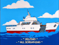

	
  

    <b>to my github</b>
  

  
  
  
	 
	 

**I write code** . **I ship it** .
**It breaks** . **I fix it** 
<!--
**darongaffirm/darongaffirm** is a ✨ _special_ ✨ repository because its `README.md` (this file) appears on your GitHub profile.

Here are some ideas to get you started:

- 🔭 I’m currently working on ...
- 🌱 I’m currently learning ...
- 👯 I’m looking to collaborate on ...
- 🤔 I’m looking for help with ...
- 💬 Ask me about ...
- 📫 How to reach me: ...
- 😄 Pronouns: ...
- ⚡ Fun fact: ...
-->

